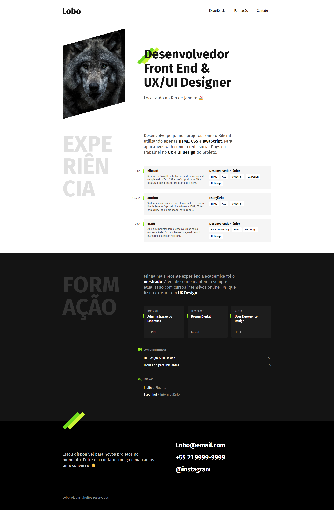

# 📌 Mini Portfólio – Curso Origamid

Este é um projeto desenvolvido como parte do curso **[HTML e CSS para Iniciantes](https://www.origamid.com/curso/html-e-css-para-iniciantes/)** da Origamid.  
O objetivo principal foi praticar a estruturação semântica em **HTML5** e o uso de **CSS3** para criar um layout responsivo.

---

## 🚀 Preview

🔗 [Acesse o projeto online aqui](https://www.origamid.com/projetos/portfolio/)  

---

## 🛠 Tecnologias utilizadas

- HTML5  
- CSS3 (Flexbox, Grid e responsividade)  

---

## 🎯 Objetivos de aprendizado

- Estruturar páginas com HTML semântico  
- Criar layouts responsivos com CSS  
- Organizar e reutilizar estilos de forma eficiente  

---

## 📂 Status do projeto

✅ Concluído – Projeto guiado do curso Origamid

---

## 📝 Observações

Este projeto foi feito **de forma guiada**, seguindo as aulas do curso da Origamid.  
O código e o design foram mantidos próximos ao exemplo do professor, com o objetivo de **consolidar os fundamentos de HTML e CSS**.
