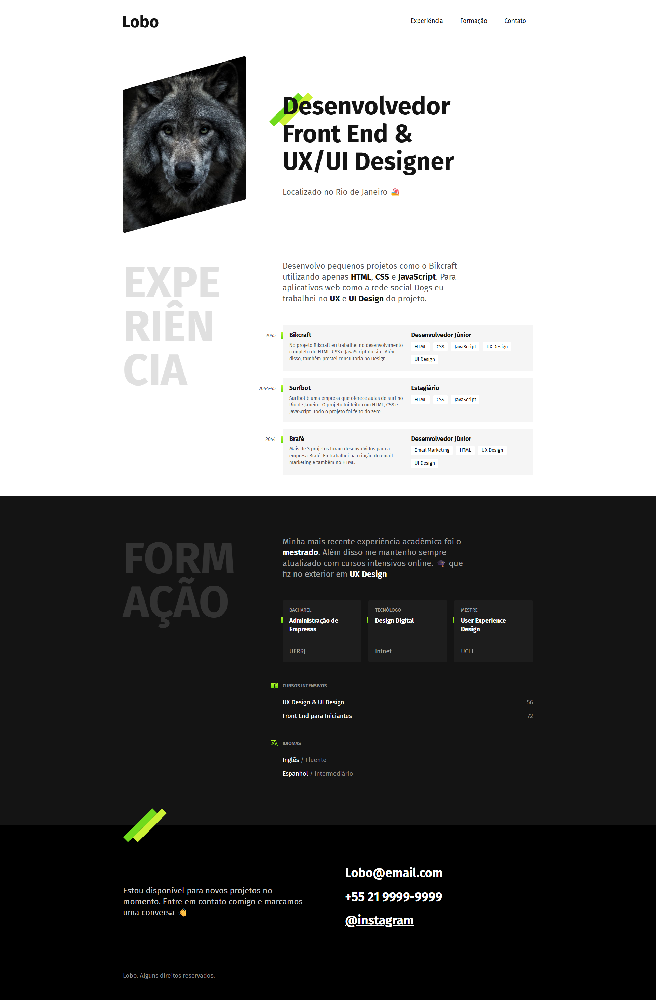

# 📌 Mini Portfólio – Curso Origamid

Este é um projeto desenvolvido como parte do curso **[HTML e CSS para Iniciantes](https://www.origamid.com/curso/html-e-css-para-iniciantes/)** da Origamid.  
O objetivo principal foi praticar a estruturação semântica em **HTML5** e o uso de **CSS3** para criar um layout responsivo.

---

## 🚀 Preview

🔗 [Acesse o projeto online aqui](https://thur-code.github.io/mini-portfolio-origamid/)  

---

## 🛠 Tecnologias utilizadas

- **HTML5** (estrutura semântica)  
- **CSS3** (estilização e layout)  
- **Flexbox** (organização dos elementos em seções)  
- **Responsividade** (ajuste do layout em diferentes telas)

---

## 🎯 Objetivos de aprendizado

- Estrutura inicial de pastas e arquivos  
- Uso de tags semânticas (header, main, footer, section, article etc.)  
- Inserção e estilização de imagens e ícones  
- Estilização tipográfica (cores, tamanhos e hierarquia de textos)  
- Box Model (margins, paddings, borders)  
- Flexbox (alinhamento e distribuição de elementos)  
- Organização de layout em colunas e linhas  
- Responsividade com media queries  
- Boas práticas na organização do código

---

## 📂 Status do projeto

✅ Concluído

---

## 📝 Observações

Este projeto foi feito **de forma guiada**, seguindo as aulas do curso da Origamid.  
O código e o design foram mantidos próximos ao exemplo do professor, com o objetivo de **consolidar os fundamentos de HTML e CSS**.
